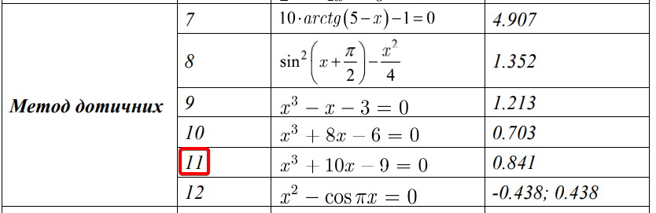
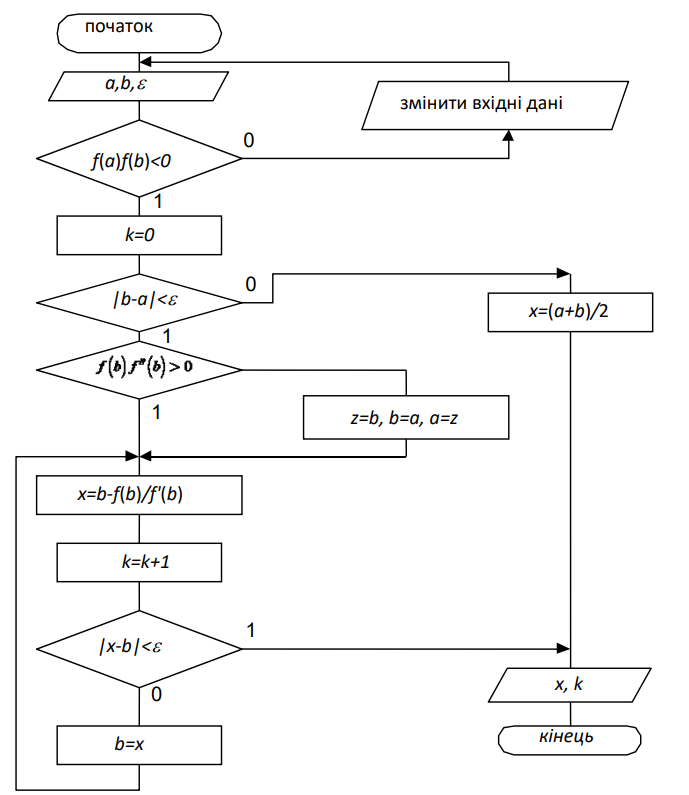
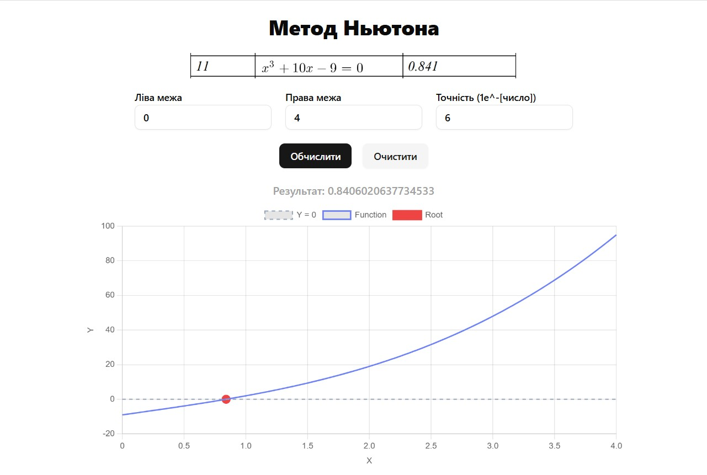
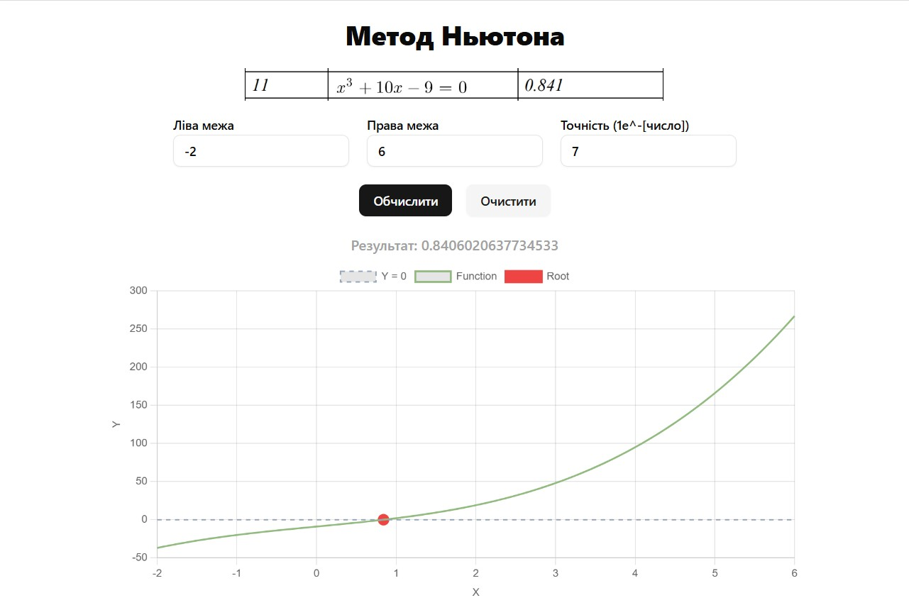
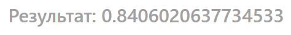
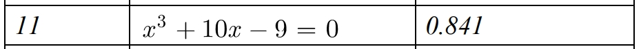

# Лабораторна робота №4

## Відомості

### Тема

Розв’язання нелінійних рівнянь

### Мета

Метою даного заняття є ознайомлення з методиками та вивчення різних алгоритмів розв’язання нелінійних рівнянь на комп’ютері

### Завдання

Закріплення знань студентів при вирішенні практичних завдань з розв’язування нелінійних рівнянь. Оволодіння методами і практичними навичками розв’язування нелінійних рівнянь на комп’ютері. Набуття умінь і навичок при програмуванні та налагодженні програм для розв’язування нелінійних рівнянь на комп'ютері.

### Варіант



### Блок-схеми алгоритму



## Хід роботи

### Код програми

#### Алгоритм

```ts
function func(x: number): number {
  return Math.pow(x, 3) + 10 * x - 9
}

function dfunc(x: number): number {
  return 3 * Math.pow(x, 2) + 10
}

interface NewtonMethodProps {
  x0: number
  eps: number
  maxIter?: number
}

const newtonMethod = ({
  x0,
  eps,
  maxIter = 1000
}: NewtonMethodProps): number | null => {
  let xPrev = x0

  for (let i = 0; i < maxIter; i++) {
    const xNext = xPrev - func(xPrev) / dfunc(xPrev)

    if (Math.abs(xNext - xPrev) < eps) return xNext

    xPrev = xNext
  }

  return null
}

export { func, dfunc }
export default newtonMethod
```

#### Програма та графічний інтерфейс

##### App.tsx

```ts
import Header from './components/Header'
import FormComp from './components/FormComp'
import Charts from './components/Charts'

const App = () => {
  return (
    <main className="flex flex-col gap-5 p-5">
      <Header />
      <FormComp />
      <Charts />
    </main>
  )
}

export default App
```

##### Header.tsx

```ts
const Header = () => {
  return (
    <>
      <h1 className="w-full text-center text-3xl font-extrabold">
        Метод Ньютона
      </h1>
      
    </>
  )
}

export default Header
```

##### FormComp.tsx

```ts
import { useForm } from 'react-hook-form'

import Buttons from './Buttons'
import { formFields } from './common/form-fields'

import { Label } from '../ui/label'
import { Input } from '../ui/input'

import useChartContext from '../../common/hooks/use-chart-context'
import useFormSearchParams from '../../common/hooks/use-form-search-param'
import newtonMethod from '../../lib/algorithm'
import generateChartData from '../../utils/generate-chart-data'

const FormComp = () => {
  const { setChartsVisible, setChartData } = useChartContext()
  const { register, handleSubmit, setValue } = useForm({
    shouldUseNativeValidation: true,
    defaultValues: { a: 0, b: 4, e: 6 }
  })
  const { updateSearchParams } = useFormSearchParams(setValue)

  const onSubmit = async (data: { a: number; b: number; e: number }) => {
    const updatedData = updateSearchParams(data)

    const x0 = (updatedData.a + updatedData.b) / 2
    const eps = Math.pow(10, -updatedData.e)

    const root = newtonMethod({ x0, eps })
    const result = generateChartData(updatedData.a, updatedData.b, root)

    if (result) {
      setChartData(result)
      setChartsVisible(true)
    }
  }

  return (
    <form
      onSubmit={handleSubmit(onSubmit)}
      className="flex w-full flex-col items-center gap-5"
    >
      <div className="flex gap-5">
        {formFields.map(({ name, placeholder }) => (
          <div className="flex flex-col gap-1 font-semibold" key={name}>
            <Label htmlFor={name}>{placeholder}</Label>
            <Input
              {...register(name as 'a' | 'b' | 'e', { valueAsNumber: true })}
              type="number"
              placeholder="Число"
              key={name}
              id={`input${name.toUpperCase()}`}
            />
          </div>
        ))}
      </div>

      <Buttons />
    </form>
  )
}

export default FormComp
```

##### Buttons.tsx

```ts
import { Button } from '../../ui/button'

import useChartContext from '../../../common/hooks/use-chart-context'

const Buttons = () => {
  const { chartsVisible, setChartsVisible, setChartData } = useChartContext()

  const handleClear = () => {
    setChartsVisible(false)
    setChartData(null)
  }

  return (
    <div className="flex gap-4">
      <Button type="submit">Обчислити</Button>
      {chartsVisible && (
        <Button type="button" variant="secondary" onClick={handleClear}>
          Очистити
        </Button>
      )}
    </div>
  )
}

export default Buttons
```

##### Charts.tsx

```ts
import { useMemo } from 'react'
import { Line } from 'react-chartjs-2'
import {
  Chart as ChartJS,
  CategoryScale,
  LinearScale,
  PointElement,
  LineElement,
  Title,
  Tooltip,
  Legend,
  TooltipItem
} from 'chart.js'

import useChartContext from '../../common/hooks/use-chart-context'
import { getRandomColor } from '../../utils/get-random-color'

ChartJS.register(
  CategoryScale,
  LinearScale,
  PointElement,
  LineElement,
  Title,
  Tooltip,
  Legend
)

const Charts = () => {
  const { chartsVisible, chartData } = useChartContext()

  const formattedPoints = useMemo(() => {
    if (!chartData?.points) return []

    return chartData.points.map((point) => ({ x: point.x, y: point.y }))
  }, [chartData])

  const zeroLineData = useMemo(() => {
    if (!formattedPoints.length) return []

    const xValues = formattedPoints.map((p) => p.x)
    const minX = Math.min(...xValues)
    const maxX = Math.max(...xValues)

    return [
      { x: minX, y: 0 },
      { x: maxX, y: 0 }
    ]
  }, [formattedPoints])

  const data = useMemo(
    () => ({
      datasets: [
        {
          label: 'Y = 0',
          data: zeroLineData,
          borderColor: '#94a3b8',
          borderWidth: 1.5,
          borderDash: [5, 5],
          pointRadius: 0,
          tension: 0
        },
        {
          label: 'Function',
          data: formattedPoints,
          borderColor: getRandomColor(),
          borderWidth: 2,
          tension: 0.1,
          pointRadius: 0
        },
        {
          label: 'Root',
          data: chartData?.root ? [chartData.root] : [],
          backgroundColor: '#ef4444', // red
          borderColor: '#ef4444',
          pointRadius: 6,
          pointHoverRadius: 8,
          showLine: false
        }
      ]
    }),
    [formattedPoints, chartData?.root, zeroLineData]
  )

  const options = useMemo(
    () => ({
      responsive: true,
      maintainAspectRatio: false,
      scales: {
        x: {
          type: 'linear' as const,
          position: 'bottom',
          title: {
            display: true,
            text: 'X'
          }
        },
        y: {
          title: {
            display: true,
            text: 'Y'
          }
        }
      },
      plugins: {
        tooltip: {
          callbacks: {
            label: (context: TooltipItem<'line'>) => {
              const point = context.raw as { x: number; y: number }
              if (point.y === 0) {
                return `Root: (${point.x.toFixed(4)}, ${point.y})`
              }
              return `(${point.x.toFixed(2)}, ${point.y.toFixed(2)})`
            }
          }
        }
      }
    }),
    []
  )

  if (!chartsVisible || !chartData) return null

  return (
    <div className="flex h-[50vh] px-5">
      <div className="w-196 mx-auto">
        <h3 className="mb-2 text-center font-medium text-neutral-400">
          Результат: {chartData.root?.x}
        </h3>
        <Line data={data} options={options} />
      </div>
    </div>
  )
}

export default Charts
```

<div style="page-break-before: always;">

#### Context

##### ChartContext.tsx

```ts
import { createContext, ReactNode, SetStateAction, useState } from 'react'

import { ChartData } from '../../types/chart-data'

interface ChartContextProps {
  chartsVisible: boolean
  setChartsVisible: React.Dispatch<SetStateAction<boolean>>
  chartData: ChartData | null
  setChartData: React.Dispatch<SetStateAction<ChartData | null>>
}

const ChartContext = createContext<ChartContextProps | undefined>(undefined)

const ChartProvider = ({ children }: { children: ReactNode }) => {
  const [chartsVisible, setChartsVisible] = useState(false)
  const [chartData, setChartData] = useState<ChartData | null>(null)

  return (
    <ChartContext.Provider
      value={{
        chartsVisible,
        setChartsVisible,
        chartData,
        setChartData
      }}
    >
      {children}
    </ChartContext.Provider>
  )
}

export { ChartContext }
export default ChartProvider
```

<div style="page-break-before: always;">

#### Hooks

##### useChartContext.tsx

```ts
import { useContext } from 'react'

import { ChartContext } from '../context/chart-context'

const useChartContext = () => {
  const context = useContext(ChartContext)

  if (context === undefined) {
    throw new Error('useChartContext must be used within a ChartProvider')
  }
  return context
}

export default useChartContext
```

##### useFormSearchParams.tsx

```ts
import { useEffect } from 'react'
import { UseFormSetValue } from 'react-hook-form'
import { useSearchParams } from 'react-router-dom'

type FormValues = {
  a: number
  b: number
  e: number
}

const useFormSearchParams = (setValue: UseFormSetValue<FormValues>) => {
  const [searchParams, setSearchParams] = useSearchParams()

  const getInitialValues = () => ({
    a: searchParams.get('a') ? Number(searchParams.get('a')) : 0,
    b: searchParams.get('b') ? Number(searchParams.get('b')) : 4,
    e: searchParams.get('e') ? Number(searchParams.get('e')) : 6
  })

  useEffect(() => {
    const a = searchParams.get('a')
    const b = searchParams.get('b')
    const e = searchParams.get('e')

    if (a) setValue('a', Number(a))
    if (b) setValue('b', Number(b))
    if (e) setValue('e', Number(e))
  }, [searchParams, setValue])

  const updateSearchParams = (data: FormValues) => {
    setSearchParams({
      a: String(data.a),
      b: String(data.b),
      e: String(data.e)
    })
    return data
  }

  return {
    getInitialValues,
    updateSearchParams
  }
}

export default useFormSearchParams
```

<div style="page-break-before: always;">

#### Types

##### ChartData.ts

```ts
interface ChartData {
  points: {
    x: number
    y: number
  }[]
  root: {
    x: number
    y: number
  } | null
  function: string
}

export { type ChartData }
```

<div style="page-break-before: always;">

#### Utils

##### generateChartData.ts

```ts
import { func } from '../lib/algorithm'

const generateChartData = (a: number, b: number, root: number | null) => {
  const numPoints = 100
  const step = (b - a) / numPoints
  const points = []

  for (let i = 0; i <= numPoints; i++) {
    const x = a + i * step
    points.push({ x, y: func(x) })
  }

  return {
    points,
    root: root ? { x: root, y: 0 } : null,
    function: 'x³ + 10x - 9 = 0'
  }
}

export default generateChartData
```

##### getRandomColor.ts

```ts
const getRandomColor = () => {
  return `rgba(${Math.floor(Math.random() * 256)}, ${Math.floor(
    Math.random() * 256
  )}, ${Math.floor(Math.random() * 256)}, 1)`
}

export { getRandomColor }
```

<div style="page-break-before: always;">

### Скриншоти





### Аналіз результатів

Завдання полягало в створенні інтерфейсу для розв'язування нелінійних рівнянь методом дотичних (методом Ньютона). Реалізацію цього завдання здійснено за допомогою бібліотек React та Chart.js для відображення графіків.

Інтерфейс дозволяє користувачеві вводити область визначення, кількість значень, побудувати графіки функцій та оцінювати похибку. Після натискання кнопки "Обчислити" відбувається розв'язання рівняння та відображення результатів у відповідному полі або на графіку функції.

Код було відформатовано та покращено для зручності користувача. Інтерфейс створено з білого фону та чітко розміщених елементів, щоб спростити взаємодію з програмою. Усі кнопки та текстові поля розміщені центрально для зручності використання.

## Висновок

Результат після роботи програми зійшовся з наведеним у розділі Примітки. Отже, код працює правильно та коректно обчислює рівняння за допомогою методу дотичних (Метод Ньютона).

### Примітки




