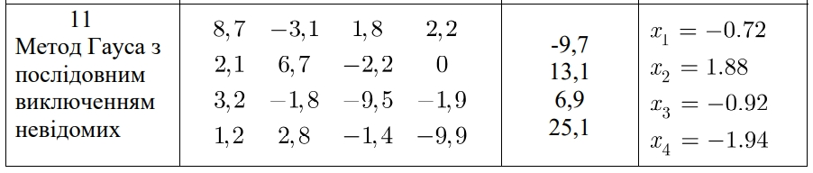
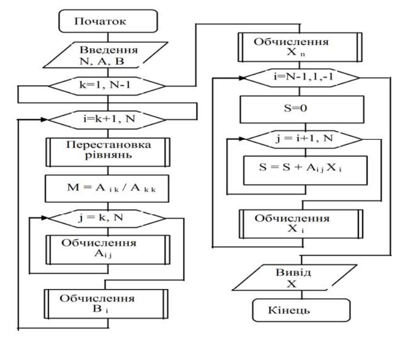
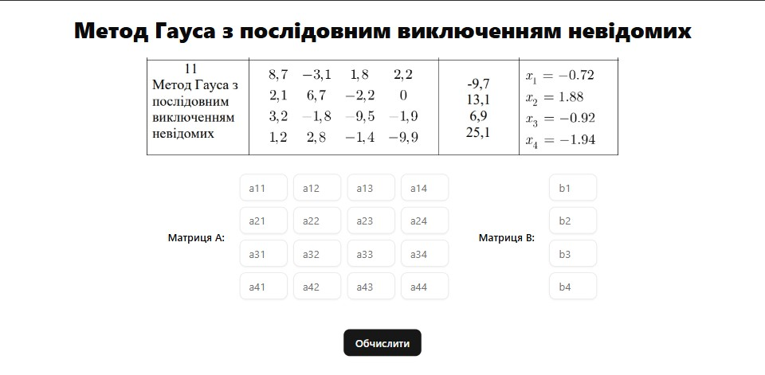
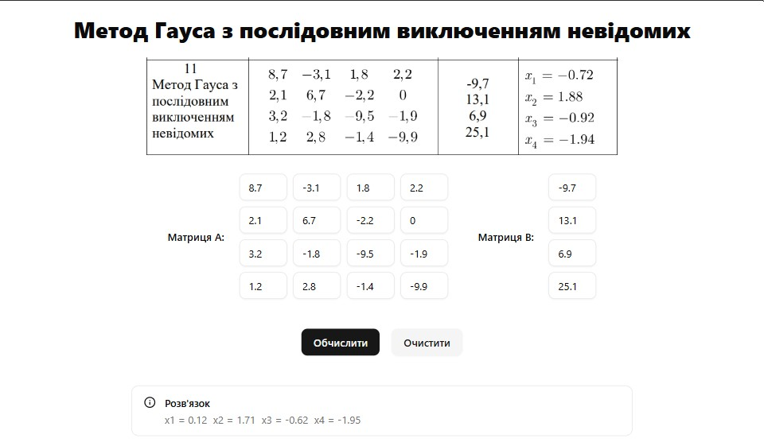
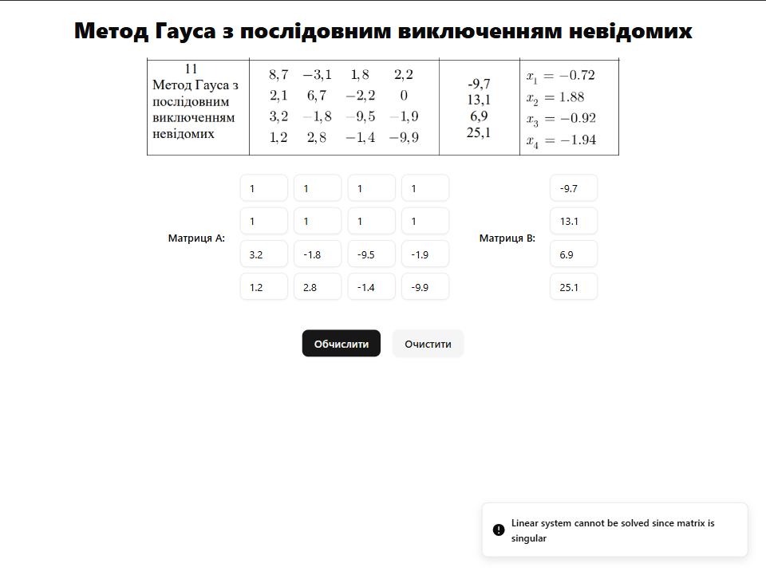

# Лабораторна робота №5

## Відомості

### Тема

Розв’язання систем лінійних алгебраїчних рівнянь

### Мета

Вивчити алгоритми методів розв'язання систем лінійних алгебраїчних рівнянь на ЕОМ

### Завдання

Відповідно до варіанту завдання скласти схему алгоритму розв’язання систем лінійних алгебраїчних рівнянь зазначеним у варіанті методом. Відповідно до блок-схеми скласти програму розв'язання систем лінійних алгебраїчних рівнянь алгоритмічною мовою, узгодженою з викладачем. Розв’язати СЛАР на комп’ютері відповідно до варіанту

### Варіант



<div style="page-break-before: always;">

### Блок-схеми алгоритму



## Хід роботи

### Код програми

#### Алгоритм

```ts
import * as math from 'mathjs'

import convertToMatrix from '../utils/convert-to-matrix'

const gaussElimination = (aData: number[], bData: number[]) => {
  const matrixA = convertToMatrix(aData)

  const solution = math.lusolve(matrixA, bData) as number[][]

  return {
    x1: solution[0][0],
    x2: solution[1][0],
    x3: solution[2][0],
    x4: solution[3][0]
  }
}

export default gaussElimination
```

#### Програма та графічний інтерфейс

##### App.tsx

```ts
import { Toaster } from './components/ui/sonner'

import Header from './components/Header'
import FormComp from './components/FormComp'

const App = () => {
  return (
    <main className="flex flex-col gap-5 p-5">
      <Header />
      <FormComp />
      <Toaster />
    </main>
  )
}

export default App
```

##### Header.tsx

```ts
const Header = () => {
  return (
    <>
      <h1 className="w-full text-center text-3xl font-extrabold">
        Метод Гауса з послідовним виключенням невідомих
      </h1>
      
    </>
  )
}

export default Header
```

##### FormComp.tsx

```ts
import { useState } from 'react'
import { useForm } from 'react-hook-form'
import { toast } from 'sonner'

import MatrixInput from './MatrixInput'
import Solution from './Solution'
import { aFormFields, bFormFields } from './common/form-fields'

import gaussElimination from '../../lib/algorithm'
import { SolutionType } from '../../types/solution'
import { Button } from '../ui/button'

const FormComp = () => {
  const [solution, setSolution] = useState<SolutionType | null>(null)

  const {
    register,
    handleSubmit,
    setValue,
    reset,
    formState: { isSubmitted }
  } = useForm<SolutionType>({
    mode: 'onChange'
  })

  const validateAndFixNaNValues = (data: SolutionType): boolean => {
    const allFields = [...aFormFields, ...bFormFields]
    let hasNaN = false

    for (const { name, defaultValue } of allFields) {
      if (isNaN(data[name])) {
        hasNaN = true
        setValue(name, defaultValue)
      }
    }

    return hasNaN
  }

  const onSubmit = async (data: SolutionType) => {
    if (validateAndFixNaNValues(data)) {
      setTimeout(() => handleSubmit(onSubmit)(), 0)
      return
    }

    try {
      const aData = aFormFields.map((field) => data[field.name])
      const bData = bFormFields.map((field) => data[field.name])

      setSolution(gaussElimination(aData, bData))
    } catch (error) {
      toast.error(error instanceof Error ? error.message : 'Calculation error')
    }
  }

  const handleReset = () => {
    setSolution(null)
    reset()
  }

  return (
    <form
      onSubmit={handleSubmit(onSubmit)}
      className="flex w-full flex-col items-center gap-10"
    >
      <div className="flex w-full items-center justify-center gap-10">
        <MatrixInput
          label="Матриця А:"
          fields={aFormFields}
          register={register}
        />

        <MatrixInput
          label="Матриця B:"
          fields={bFormFields}
          register={register}
          columns={1}
        />
      </div>

      <div className="flex gap-4">
        <Button type="submit">Обчислити</Button>
        {isSubmitted && (
          <Button type="button" variant="secondary" onClick={handleReset}>
            Очистити
          </Button>
        )}
      </div>

      <Solution solution={solution} />
    </form>
  )
}

export default FormComp
```

##### MatrixInput.tsx

```ts
import { UseFormRegister } from 'react-hook-form'
import clsx from 'clsx'

import { Input } from '../../ui/input'
import { Label } from '../../ui/label'

import { SolutionType } from '../../../types/solution'

type MatrixInputProps = {
  label: string
  fields: Array<{ name: string }>
  register: UseFormRegister<SolutionType>
  columns?: 1 | 2 | 3 | 4 | 5 | 6
}

const gridClasses = {
  1: 'grid-cols-1',
  2: 'grid-cols-2',
  3: 'grid-cols-3',
  4: 'grid-cols-4',
  5: 'grid-cols-5',
  6: 'grid-cols-6'
}

const MatrixInput = ({
  label,
  fields,
  register,
  columns = 4
}: MatrixInputProps) => {
  const InputMap = fields.map(({ name }) => (
    <Input
      type="number"
      step="any"
      placeholder={name}
      key={name}
      {...register(name, { valueAsNumber: true })}
      className="w-16"
    />
  ))

  return (
    <div className="flex gap-5">
      <Label>{label}</Label>
      <div className={clsx(`grid gap-2`, gridClasses[columns])}>{InputMap}</div>
    </div>
  )
}

export default MatrixInput
```

##### Solution.tsx

```ts
import { Info } from 'lucide-react'
import { Alert, AlertDescription, AlertTitle } from '../../ui/alert'
import { SolutionType } from '../../../types/solution'

const Solution = ({ solution }: { solution: SolutionType | null }) => {
  if (!solution) return null

  const Results = Object.entries(solution).map(([key, value]) => (
    <span key={key}>
      {key} = {value.toFixed(2)}
    </span>
  ))

  return (
    <Alert className="w-full max-w-2xl" variant="default">
      <Info />
      <AlertTitle>Розв'язок</AlertTitle>
      <AlertDescription className="flex gap-2">{Results}</AlertDescription>
    </Alert>
  )
}

export default Solution

```

#### Constants

##### form-field.ts

```ts
const aData = [
  [8.7, -3.1, 1.8, 2.2],
  [2.1, 6.7, -2.2, 0],
  [3.2, -1.8, -9.5, -1.9],
  [1.2, 2.8, -1.4, -9.9]
]

const bData = [-9.7, 13.1, 6.9, 25.1]

const aFormFields = aData.flatMap((row, rowIndex) =>
  row.map((value, colIndex) => ({
    name: `a${rowIndex + 1}${colIndex + 1}`,
    defaultValue: value
  }))
)

const bFormFields = bData.map((value, index) => ({
  name: `b${index + 1}`,
  defaultValue: value
}))

export { aFormFields, bFormFields, aData, bData }
```

<div style="page-break-before: always;">

#### Types

##### solution.ts

```ts
export type SolutionType = {
  [key: string]: number
}
```

#### Utils

##### convert-to-matrix.ts

```ts
const convertToMatrix = (flatArray: number[], columnsPerRow = 4) => {
  const matrix = []

  for (let i = 0; i < flatArray.length; i += columnsPerRow) {
    matrix.push(flatArray.slice(i, i + columnsPerRow))
  }

  return matrix
}

export default convertToMatrix
```

<div style="page-break-before: always;">

### Скриншоти







## Аналіз та висновок

Ця програма використовує бібліотеку React для створення графічного інтерфейсу користувача на JavaScript, що дозволяє розв'язувати системи лінійних рівнянь методом Гаусса з послідовним виключенням невідомих

### Кроки методу Гаусса

#### Прямий хід

Cкладається з послідовного виключення невідомих, щоб перетворити початкову систему на еквівалентну систему, де матриця коефіцієнтів має верхньо-трикутну форму.

##### Вибір ведучого елемента

Для стійкості алгоритму важливо вибрати найбільший за модулем елемент у стовпці що мінімізує числові помилки. Ведучий елемент вибирається у поточному стовпці, і рядки можуть бути переставлені для розміщення цього елемента на діагоналі.

##### Виключення

Для кожного рядка під поточним ведучим елементом використовується лінійна комбінація з верхніх рядків, щоб обнулити елементи під діагоналлю. Це досягається множенням ведучого рядка на відповідний коефіцієнт і відніманням його від кожного з наступних рядків.

#### Зворотній хід

Після того, як матриця приведена до верхньо-трикутної форми, виконується зворотній хід, де розв'язки знаходяться шляхом заміщення назад.

##### Розв'язування

Починаючи з останнього рівняння системи шляхом підстановки координат вектора невідомих, отриманих на попередньому кроці.Значення змінних отримують, рухаючись у зворотному порядку від останнього рівняння до першого.

##### Основні вікна та інтерфейс

Головне вікно дозволяє користувачеві вводити коефіцієнти і вільні члени системи рівнянь 4х4.

##### Функціональність програми

###### Розв'язання систем рівнянь

Користувач може вводити дані в полі вводу і використовувати кнопку "розв'язати" для знаходження розв'язків за допомогою методу Гаусса.

###### Заповнення даних

Користувач може автоматично заповнити поля вводу заздалегідь заданими значеннями для швидкого тестування функціональності.

###### Очищення полів

Дозволяє користувачам очистити всі поля вводу одним натисканням кнопки.

### Висновок

Ця програма є корисним інструментом для навчання та візуалізації методу Гаусса, здатна обробляти реальні задачі лінійної алгебри.Результати зійшлися тому програма реалізована коректно.
